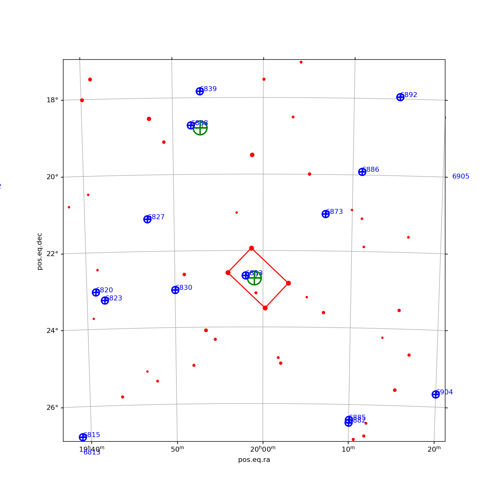

# Astrometry-Plate-Solve
Plate solver based on astrometry.net to generate sky-plot image without internet using index files

## 1. Installation Instruction :

```
sudo apt-get install astrometry.net
sudo apt-get install astrometry-data-tycho2
```

Download index files with wget in this adresse : http://broiler.astrometry.net/~dstn/4200/
Be careful, there is about ~30Go of data.
```
wget -r -c http://broiler.astrometry.net/~dstn/4200/
```

And for widefiled image : http://broiler.astrometry.net/~dstn/4100/
```
wget -r -c http://broiler.astrometry.net/~dstn/4100/
```

Place the index file (index-xxxx.fits) on : /usr/share/astrometry/

### 1.1 Install dependency :
```
sudo apt-get install python-dev libatlas-base-dev
pip3 install ligo.skymap
pip3 install astropy
pip3 install pillow
pip3 install matplotlib
```

## 2. Run application :
```
python3 main.py --image M27.png --focale 1000 --photosite 4.8
```

Other parameter
```
--fov -> the size of the skyplot image : default 5
--starsize -> the size of the star : default 9
--downscale -> downscale to apply to the image : default 2
--percent -> percent of error of the angular resolution (Focale, photosite) : default 20
```

## 3. Imporvement to do :
- Optimize for high FOV image
- Better representation of star
- Put name of object next to the object, not in front

## 4. Result Example

